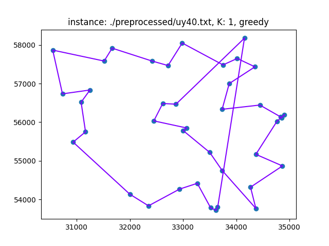
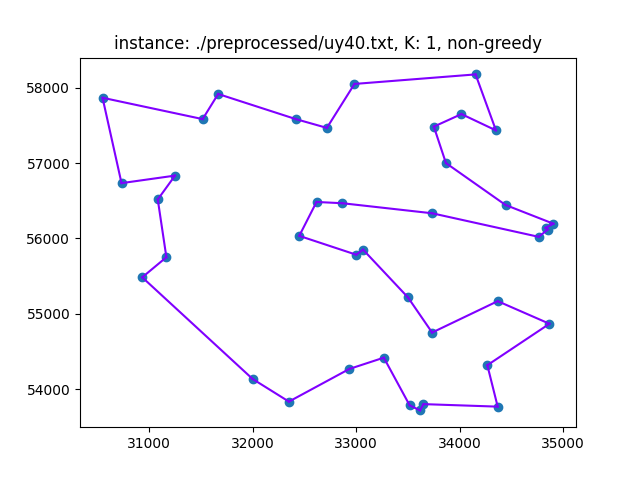

# KITTSP: k-Independent Tours Traveling Salesman Problem

This repository provides a solver for the **k-Independent Tours Traveling Salesman Problem (KITTSP)**, a complex generalization of the classic Traveling Salesman Problem (TSP).

## Overview

The objective of this project is to find $K$ independent tours within a given graph, where each tour visits every node exactly once. Two tours are strictly defined as **independent** if they do not share a single edge.

This implementation models KITTSP as a **binary-linear programming problem**, relying on advanced graph theory and mathematical optimization techniques.

## Mathematical Formulation & Tools

To solve this problem, we utilize **IBM ILOG CPLEX**, a high-performance mathematical programming solver for linear and mixed-integer programming. 

> **Further Reading:**
> * Framework details: [IBM CPLEX Optimization Studio](https://www.ibm.com/products/ilog-cplex-optimization-studio/cplex-optimizer)
> * Problem background: [KITTSP Research Paper](https://link.springer.com/chapter/10.1007/978-3-031-28183-9_44)

---

## Getting Started

### Installation

It is highly recommended to run this project inside a virtual environment. You can set it up and install the required dependencies (`numpy`, `matplotlib`, `cplex`, `icecream`) using the commands below, depending on your operating system:

**Windows**
```powershell
python -m venv venv
venv\Scripts\activate
pip install numpy matplotlib cplex icecream
```

**Linux / macOS**
```bash
python3 -m venv venv
source venv/bin/activate
pip install numpy matplotlib cplex icecream
```

> **Note:** On Linux, you may need to install the `python3-venv` package first (e.g., `sudo apt install python3-venv` on Ubuntu/Debian) if your system doesn't include it by default.

## Results and Visualizations

Below are the visual representations of the computed tours. The plots illustrate the $K$ independent routes generated by the solver, verifying that no edges overlap between the distinct tours.

### Example 1: Greedy Approach

Total cost of the sollution is $28371$.



### Example 2: Non-Greedy (Full Optimization) Approach

Total cost of the sollution is $23297$.


